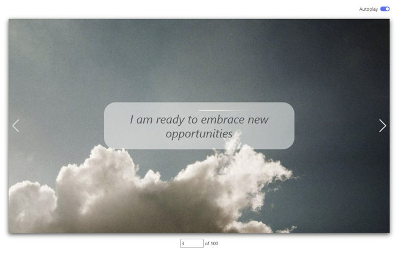

<!-- Improved compatibility of back to top link: See: https://github.com/othneildrew/Best-README-Template/pull/73 -->

<!--
*** Thanks for checking out the Best-README-Template. If you have a suggestion
*** that would make this better, please fork the repo and create a pull request
*** or simply open an issue with the tag "enhancement".
*** Don't forget to give the project a star!
*** Thanks again! Now go create something AMAZING! :D
-->

<!-- PROJECT SHIELDS -->
<!--
*** I'm using markdown "reference style" links for readability.
*** Reference links are enclosed in brackets [ ] instead of parentheses ( ).
*** See the bottom of this document for the declaration of the reference variables
*** for contributors-url, forks-url, etc. This is an optional, concise syntax you may use.
*** https://www.markdownguide.org/basic-syntax/#reference-style-links
-->

<!-- PROJECT LOGO -->
 

  

<h3 align="center">Affirmations</h3>

  

    A carousel of "I am" affirmations using Swiper.js
     
     
    <a href="https://jbrace817.github.io/affirmations/">View Demo</a>
    ·
    <a href="https://github.com/jbrace817/affirmations/issues/new?labels=bug&template=bug-report---.md">Report Bug</a>
    ·
    <a href="https://github.com/jbrace817/affirmations/issues/new?labels=enhancement&template=feature-request---.md">Request Feature</a>
  

<!-- ABOUT THE PROJECT -->

## About The Project

<!-- [![Product Name Screen Shot][product-screenshot]]() -->

Part of my morning routine is to listen to or read some "I am" affirmations to help get my mind right. At times, I found myself looking for affirmations online, but the articles or sites I visited would just list them off. I thought a carousel of affirmations with some peaceful images would be a good project to build with React to reinforce what I am learning about state and controlled form elements. The images I used are from https://picsum.photos.

### Built With

- [![React][React.js]][React-url]
- [![Bootstrap][Bootstrap.com]][Bootstrap-url]
- 
- 

## Contact

James Brace -> [jamesfbrace](www.linkedin.com/in/jamesfbrace)

Project Link: [https://github.com/jbrace817/affirmations](https://github.com/jbrace817/affirmations)

<!-- MARKDOWN LINKS & IMAGES -->
<!-- https://www.markdownguide.org/basic-syntax/#reference-style-links -->

[contributors-shield]: https://img.shields.io/github/contributors/github_username/repo_name.svg?style=for-the-badge
[contributors-url]: https://github.com/jbrace817/affirmations/graphs/contributors
[forks-shield]: https://img.shields.io/github/forks/github_username/repo_name.svg?style=for-the-badge
[forks-url]: https://github.com/jbrace817/affirmations/network/members
[stars-shield]: https://img.shields.io/github/stars/github_username/repo_name.svg?style=for-the-badge
[stars-url]: https://github.com/jbrace817/affirmations/stargazers
[issues-shield]: https://img.shields.io/github/issues/github_username/repo_name.svg?style=for-the-badge
[issues-url]: https://github.com/jbrace817/affirmations/issues
[license-shield]: https://img.shields.io/github/license/github_username/repo_name.svg?style=for-the-badge
[license-url]: https://github.com/jbrace817/affirmations/blob/master/LICENSE.txt
[linkedin-shield]: https://img.shields.io/badge/-LinkedIn-black.svg?style=for-the-badge&logo=linkedin&colorB=555
[linkedin-url]: https://linkedin.com/in/jamesfbrace
[product-screenshot]: ./src/Images/AppScreenshot.png
[React.js]: https://img.shields.io/badge/React-20232A?style=for-the-badge&logo=react&logoColor=61DAFB
[React-url]: https://reactjs.org/
[Bootstrap.com]: https://img.shields.io/badge/Bootstrap-563D7C?style=for-the-badge&logo=bootstrap&logoColor=white
[Bootstrap-url]: https://getbootstrap.com
